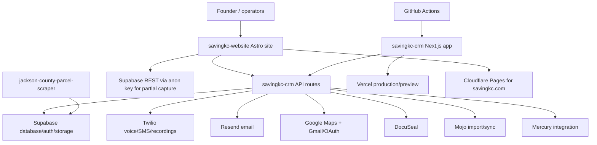

# SavingKC CRM Cleanup: System Inventory

Scope: read-only audit of the local workspace, visible Git repositories, GitHub repo settings, CI config, deployment config, and obvious integration surfaces. No code was moved or deleted.

## Executive Summary

The current single source of truth should be the GitHub repo `gxt0x2/savingkc-crm`. The local active folder is `savingkc-crm-fix`, but it is a Git worktree, not a standalone folder. It is on `codex/dialer-v2-current-crm`, with many local modified and untracked files. Cleanup must protect that work first and avoid blind pulls/resets.

Current branch note after the Twilio incident: `origin/codex/dialer-v2-current-crm` now contains the merged Twilio hotfix PR #78 and prevention PR #79. The local worktree was rebased onto that remote branch after a backup checkpoint. It is now ahead 4 with local feature/checkpoint commits plus uncommitted cleanup work.

The workspace contains three Git repos plus an uncommitted top-level Next.js app:

| Path | Status | Role | Remote |
| --- | --- | --- | --- |
| `savingkc-crm-fix` | Active CRM worktree, dirty | Primary CRM app | `gxt0x2/savingkc-crm` |
| `savingkc-website` | Clean local repo | Marketing site and lead intake | `gxt0x2/savingkc-website` |
| `jackson-county-parcel-scraper` | Dirty local repo | Parcel/enrichment side service | `gxt0x2/jackson-county-parcel-scraper` |
| workspace root | Git repo with no commits and no remote | Legacy/duplicate Next app plus clutter | none |

## Local Workspace

Workspace root: `/Users/ernestdodson/Documents/New project`

Approximate size:

| Item | Size | Notes |
| --- | ---: | --- |
| Whole workspace | 2.5G | Mostly app dependencies and generated output |
| Root `node_modules` | 658M | For legacy root app |
| `savingkc-crm-fix` | 1.4G | Active CRM plus `node_modules`, `.next`, logs, test results |
| `savingkc-crm-fix/node_modules` | 682M | Dependency install |
| `savingkc-website` | 234M | Astro site plus deps/build output |
| `jackson-county-parcel-scraper` | 187M | FastAPI/Vite side service plus deps |

Notable non-app clutter in root:

| Path | Initial classification |
| --- | --- |
| `backups/` | Keep, later move to a dated quarantine/archive area |
| `meteorite-package.txt` | Likely generated package/context dump; quarantine candidate |
| `ofw_*` files | Personal/non-CRM documents; remove from CRM workspace after safe archival |
| root `src/`, `prisma/`, `package.json` | Legacy Next.js CRM predecessor candidate |

## Active CRM Repo

Path: `savingkc-crm-fix`

Git facts:

| Field | Value |
| --- | --- |
| Git type | Worktree |
| Gitdir | `/Users/ernestdodson/savingkc-crm/.git/worktrees/savingkc-crm-fix` |
| Remote | `https://github.com/gxt0x2/savingkc-crm.git` |
| Current branch | `codex/dialer-v2-current-crm` |
| Tracking | `origin/codex/dialer-v2-current-crm` |
| State | Ahead 4, with local modified and untracked files |
| Default GitHub branch | `main` |
| Repo visibility | Public |

Important counts:

| Area | Count |
| --- | ---: |
| Next.js API route files | 157 |
| Next.js page files | 24 |
| Scripts under `scripts/` | 85 |
| Supabase SQL migrations | 42 |
| TS/TSX/JS/MJS/MTS source/test/script files | 481 |

Primary stack:

| Layer | Technology |
| --- | --- |
| Web app | Next.js 16.2.1, React 19.2.4 |
| Database/auth/storage | Supabase |
| Voice/SMS | Twilio |
| Email | Resend |
| Push notifications | Web Push / VAPID |
| Tests | Vitest, Playwright |
| Deploy | Vercel |
| CI | GitHub Actions |

Existing CRM npm scripts:

| Script | Purpose |
| --- | --- |
| `build` | Production build |
| `lint` | ESLint |
| `test`, `test:ci`, `test:coverage` | Vitest |
| `test:acceptance` | Migration acceptance script |
| `test:smoke:theme` | Playwright theme/nav smoke test |
| `gate:theme` | Theme regression guard |
| `gate:routes` | Route integrity guard |
| `gate:twilio` | Twilio token health guard |
| `gate:edge` | Vercel/Cloudflare edge integrity guard |

Phase 1 local gate baseline:

| Check | Result |
| --- | --- |
| `npm run gate:routes` | Passed |
| `npm run gate:theme` | Passed |
| `npm run test:ci` | Passed: 2 files, 59 tests |
| `npm run build` | Passed with one Turbopack NFT tracing warning |
| `npm run lint` | Failed: 475 errors, 181 warnings |
| `gate:twilio`, `gate:edge` | Not run during audit because they call live production endpoints |

Incident exception: during the Apr 30 Twilio outage response, `gate:twilio` was run against production and passed after the live fix. PR #79 strengthens this gate so it decodes token claims without printing secrets.

## Website Repo

Path: `savingkc-website`

| Field | Value |
| --- | --- |
| Remote | `https://github.com/gxt0x2/savingkc-website.git` |
| Branch | `main` tracking `origin/main` |
| State | Clean at audit time |
| Visibility | Private |
| Stack | Astro 5 static site |
| Hosting signals | Vercel project file plus Cloudflare Pages deploy script |

Important behavior:

- Lead forms POST to `https://crm.savingkc.com/api/leads`.
- Call scheduling page uses `https://crm.savingkc.com` as API base.
- `public/partial-capture.js` writes partial leads directly to Supabase using a public anon key.
- `src/components/LeadForm.astro` contains a hardcoded Google Maps browser key.

## Jackson County Parcel Scraper Repo

Path: `jackson-county-parcel-scraper`

| Field | Value |
| --- | --- |
| Remote | `https://github.com/gxt0x2/jackson-county-parcel-scraper.git` |
| Branch | `main` tracking `origin/main` |
| State | Dirty: modified backend/frontend files and untracked frontend artifacts |
| Visibility | Private |
| Stack | FastAPI/Python backend, Celery/Redis/Postgres, Vite/React frontend |

Likely role: enrichment/data service, not the production CRM UI. Keep isolated from CRM cleanup unless it is still a live dependency.

## Legacy Root App

Path: workspace root

| Field | Value |
| --- | --- |
| Package name | `saving-kc-v1` |
| Git state | Repo exists but has no commits and no remote |
| Stack | Next.js 15.2, Prisma SQLite, Twilio |
| Database | `prisma/dev.db` |
| Risk | Easy to confuse with the active CRM |

Initial classification: legacy duplicate/predecessor candidate. Do not delete yet. Quarantine after a confirmation window.

## GitHub Account Inventory

Visible owner: `gxt0x2`

| Repo | Visibility | Updated/pushed signal | Initial classification |
| --- | --- | --- | --- |
| `savingkc-crm` | Public | active | Active CRM |
| `savingkc-website` | Private | active | Active marketing site |
| `savingkc-library` | Private | recent | Ops/docs library |
| `savingkc-ops` | Private | recent | Ops automation/docs |
| `ari-skills` | Public | older | AI skills, review exposure |
| `mojo-eod-gather` | Private | older | Possible CRM-adjacent service |
| `skip-trace` | Private | older | Possible CRM-adjacent service |
| `savingkc-dialer` | Public, archived | archived | Historical dialer |
| `arios` | Private | older | Possible legacy command center |
| `clay-county-delinquent-scraper` | Private | older | Data service |
| `jackson-county-parcel-scraper` | Private | older | Local side repo |
| `jackson-county-excess-proceeds-scraper` | Private | older | Data service |
| `heartland-mls` | Private | older | Data service |
| `heir-finder` | Private | older | Data service |
| `ari-dashboard` | Private | older | Personal/dashboard legacy candidate |

## GitHub CRM Settings

Repo: `gxt0x2/savingkc-crm`

| Area | Current state |
| --- | --- |
| Visibility | Public |
| Default branch | `main` |
| Branch protection | Enabled on `main` |
| Required checks | `gate-build-and-theme`, `gate-twilio-token-health`, `gitleaks` |
| Missing required check | `gate-edge-integrity` exists in workflow but is not required |
| PR reviews | Required review object exists, but required approvals is `0` |
| CODEOWNERS | Not present |
| Conversation resolution | Required |
| Admin enforcement | Enabled |
| Force pushes/deletions | Disabled |
| Rulesets | None |
| Actions permissions | All actions allowed, SHA pinning not required |
| Repo Actions secrets | None |
| Repo Actions variables | None |
| Environments | 6 deployment environments, including duplicate `Production` and `Production - savingkc-crm*` names |
| Open PRs | 7 found, including Dependabot PRs and stale/stacked feature PRs |
| Labels | Mostly GitHub defaults plus dependency labels |

Private repos `savingkc-website` and `jackson-county-parcel-scraper` do not currently have local `.github` workflows. GitHub reported secret scanning and Dependabot alerts disabled/unavailable for those private repos under current account settings.

## CI And Gates

CRM workflows:

| Workflow | File | Notes |
| --- | --- | --- |
| Quality Gates | `.github/workflows/quality-gates.yml` | Build, route, theme, smoke, Twilio health, edge integrity |
| Secret Scan | `.github/workflows/secret-scan.yml` | Gitleaks action using `.gitleaks.toml` |
| Baseline Tags | `.github/workflows/tag-baseline.yml` | Tags each push to `main` as rollback point |

Important gap: local `gitleaks` CLI is not installed. CI uses the action, but local Phase checks cannot run Gitleaks unless we install or use an alternative.

## Deployment And Hosting Signals

Vercel local project files:

| App | Project name | Project ID |
| --- | --- | --- |
| CRM | `savingkc-crm` | present in `.vercel/project.json` |
| Website | `savingkc-website` | present in `.vercel/project.json` |

Vercel live connector status:

- Local project IDs were visible.
- Live CRM project lookup returned `403 Forbidden`.
- Vercel team list returned empty.
- Treat Vercel production settings/env/domain inventory as an access gap until dashboard or API access is confirmed.

Cloudflare signals:

- `savingkc-website/deploy.sh` deploys `dist` to Cloudflare Pages project `savingkc-homebuyers`.
- CRM edge integrity gate expects both Vercel and Cloudflare signals.

## Integration Map

| Integration | Evidence | Risk notes |
| --- | --- | --- |
| Supabase | `src/lib/supabase/*`, migrations, env files, website partial capture | Service-role key is used server-side; public anon key is intentionally browser-visible but RLS must be correct |
| Twilio | token, IVR, SMS, recordings, missed-call routes/scripts | Critical production path; GitHub open secret alert for Twilio account SID |
| Vercel | `.vercel/project.json`, `vercel.json`, GitHub homepage | Live API access blocked during audit |
| Cloudflare | website deploy script, edge integrity docs/gate | Needs dashboard inventory |
| Resend | env example and broadcast/conversation send routes | Needs env ownership and send-domain verification |
| Google Maps | website hardcoded browser key, CRM maps routes | Key exposure must be restricted/rotated if unrestricted |
| Google/Gmail auth | CRM auth/google routes and Gmail sync | OAuth app/client secrets need inventory |
| DocuSeal | CRM docuseal library/webhook, deploy docs | Webhook secret/token inventory needed |
| Mojo | worker/admin/API routes and scripts | Session/password handling needs review |
| Mercury | `src/lib/mercury-api.ts`, integration route | API key/env ownership unknown |
| Web Push | push routes, VAPID envs | Private key present locally; rotate if exposed |
| County/Zillow/Redfin enrichment | libs/scripts | May depend on scraper/API keys |

## Single Source Of Truth Architecture

Canonical operational source should become:

1. `gxt0x2/savingkc-crm`: CRM app, DB migrations, CI gates, runbooks.
2. `gxt0x2/savingkc-website`: marketing site and lead intake only.
3. Service repos: isolated and documented as dependencies, not mixed into CRM app cleanup.
4. Local quarantine: temporary holding area for legacy/unknown workspace files before deletion.

## Access Gaps

These items need owner confirmation or additional access before Phase 2+ execution:

1. Which Vercel team/project owns production `crm.savingkc.com`.
2. Whether Cloudflare is proxying `crm.savingkc.com`, `savingkc.com`, or both.
3. Whether open GitHub secret alerts have already been rotated externally.
4. Whether `jackson-county-parcel-scraper` is live, paused, or historical.
5. Whether root `saving-kc-v1` has any production-only logic not ported to the active CRM.
6. Whether private repos are covered by GitHub Advanced Security, another scanner, or no scanner.
