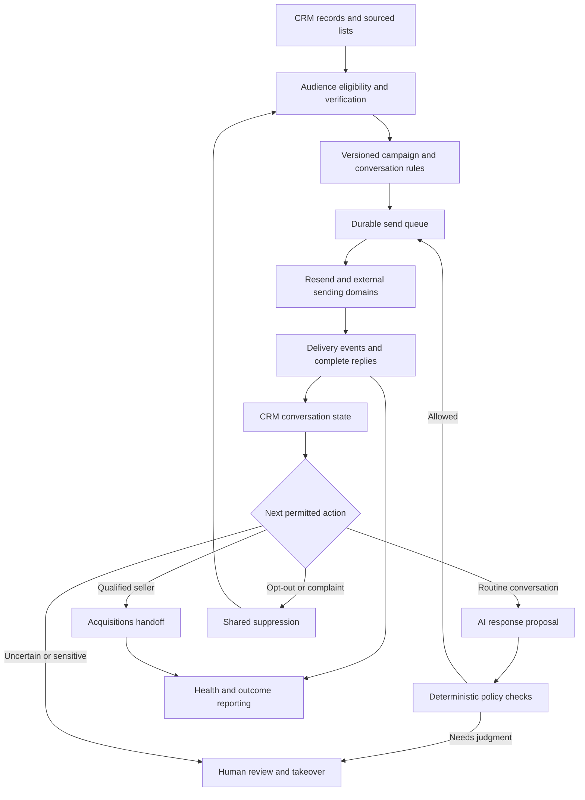

# SavingKC email marketing: high-level blueprint

Date: 2026-09-10
Updated: 2026-09-12 — added proposed first-run setup and subscription onboarding; recorded Lead/Opportunity definitions.
Updated: 2026-09-13 — Ernest/Robin purchased the three outreach domains via Cloudflare Registrar. Nameservers are on Cloudflare. Robin has landed Resend domain add + Cloudflare DNS-only email records (`talktosavingkc.com` verified; `savingkcteam.com` and `yourkchomebuyer.com` send-verified / Resend partial). This product does not treat those writes as sending-ready.
Status: Architecture baseline. The detailed v1 specification and walkthrough are now available through [the package index](README.md). This is not authorization to launch campaigns.

## Direction

Build a native Email workspace in SavingKC CRM. SavingKC owns audiences, campaigns, conversation state, AI policies, review, handoffs, suppression, and attribution. Resend is the initial sending and receiving integration, based on Ernest's statement that he checked the use case. Address verification and model inference are external services. Hosted jobs execute campaigns independently of a user's browser or Codex session.

Use independently registered sending domains. Keep SavingKC's primary business email out of campaign sender selection. Prefer recognizable SavingKC-related branding with clear SavingKC identification. Owner-purchased outreach domains are `talktosavingkc.com`, `savingkcteam.com` and `yourkchomebuyer.com`. Nameservers are on Cloudflare. Ops DNS/Resend add has landed (one domain fully verified, two partial); sending remains unauthorized until the Email product API key, hosted secrets and release auth. `savingkc.com` stays the primary business domain and is excluded from campaign senders. Domain separation reduces exposure but does not guarantee isolation from shared provider-account, IP, or brand reputation effects. A subdomain of the primary domain does not provide the same organizational-domain separation.

The initial implementation uses one provider connector behind a narrow interface. A second campaign platform is optional only if a demonstrated requirement justifies its subscription and synchronization burden. We are accepting the work of building scheduling and conversation orchestration in exchange for owning that behavior.

## Accepted inputs and proposed defaults

| Item | Status |
| --- | --- |
| External sending domains | User requirement |
| Resend as initial provider | Design assumption based on user's verification; exact account and campaign scope not independently verified |
| AI conducts bounded conversations; humans handle exceptions and acquisition | User requirement |
| Smaller Codex models implement from explicit task contracts | User requirement |
| High-level design precedes exhaustive specification and implementation | User requirement |
| Recognizable SavingKC-related domain names | Recommendation; exact names undecided |
| Native campaign engine plus direct Resend connector | Recommendation |
| Campaign-level authorization, then automatic actions inside published rules | Recommendation |
| One canonical contact and conversation system | Recommendation |
| Lead and Opportunity as the two business stages | User clarification; positive reply, callback request, and completed conversation are lead activity/status milestones |
| Guided first-run setup for services, domains, team, AI, audience, and launch | Proposed in response to the user's onboarding suggestion |

Resend's current public policy still says unsolicited cold outreach is prohibited and requires explicit opt-in. The user reports the intended use fits the guidelines. Keep the factual scope of that determination in the integration record when configuration is specified; do not encode a blanket assertion that every CRM or skip-traced address is eligible. This uncertainty does not prevent architecture and interface design.

## System architecture

Five distinct states must be modeled: campaign, recipient enrollment, message delivery, conversation ownership, and acquisition handoff. A delivered email does not mean an interested seller; an interested reply does not mean a completed call. A list member remains a prospect until the defined CRM conversion criteria are met.

Core records: existing contact/person and property references, source evidence, verified email address, audience snapshot, campaign version, sequence step, enrollment, sender identity, domain, send intent, provider message, delivery event, conversation, AI decision, review item, suppression, handoff, attribution, and cost entry. Exact schema and existing-table reuse belong in the next specification.

Business stages: a Lead is a person expressing interest in discussing the sale of a property. An Opportunity is a lead acquisitions has qualified as a real potential transaction worth pursuing. Receiving a reply or phone number alone does not create an Opportunity. Marketing and AI generate/nurture Leads; acquisitions controls qualification into Opportunities.

## Guided setup and activation

Proposed product experience: deliver a complete, ready-to-configure application with first-run setup at `/marketing/email/setup`. The operator connects existing services or completes provider signup through guided steps, supplies business choices, runs readiness checks, and prepares the first campaign. Most launch-specific decisions can be collected here instead of blocking design or UI development.

Build the setup flow alongside its corresponding integrations. Prove essential send, inbound, threading, suppression, and AI behavior with controlled development configuration early. Mock success is not evidence that an external integration works. Provider/account access may still be needed during development for real integration validation; connecting final production accounts can happen through onboarding later.

| Step | Operator experience | System behavior and completion evidence |
| --- | --- | --- |
| 1. Business and program | Choose seller outreach, seller nurture, or buyer marketing; confirm SavingKC identity, business address, timezone, and sender branding | Save business/program configuration; tailor subsequent messaging and qualification settings |
| 2. Services and subscriptions | Review existing email, AI, and address-verification connections; choose Connect existing or Create account where needed | Reuse valid connections; identify actual missing capabilities; show needed permissions and incremental costs; verify server access before marking connected |
| 3. Sending domains | Add owned domains or select candidates to purchase through the registrar | Check ownership/availability when supported; guide purchase with visible price/renewal terms; prepare required records and validate DNS/inbound routing; retain pending progress during propagation |
| 4. Sender identities | Enter recognizable From names and addresses and choose reply handling | Link identities to verified domains; verify incoming/outgoing correspondence path and preserve stable identities for active threads |
| 5. Team and handoffs | Select exception reviewer, acquisition owner, backup, operating hours, and optional calendar connection | Resolve users/roles, record response expectations, and check calendar access; use manual scheduling until an optional calendar connection is ready |
| 6. AI behavior | Choose draft-only or bounded automatic handling; review qualification questions and escalation examples | Save a versioned policy, validate required AI capability, and run representative simulations with visible expected results |
| 7. First audience | Select a CRM segment or import a list and map fields | Preview matches, duplicates, verified addresses, exclusions, uncertain identity, and permitted campaign eligibility before enrollment |
| 8. First campaign | Review proposed copy, sequence, sender selection, hours, limits, and Lead-to-Opportunity rules | Create a draft campaign; show recipient count, maximum touches, projected activity, and ownership; no sending from simply completing a form |
| 9. Readiness checks | Run controlled checks and resolve precise failed items | Test authorized send/receive flow, thread persistence, takeover, opt-out, worker readiness, and recovery; distinguish simulation results from actual provider checks |
| 10. Cost review and activation | Review recurring/usage costs, campaign scope, and spending caps; finish setup or deliberately launch | Save setup completion separately from campaign launch; launch revalidates current readiness and publishes the exact campaign configuration once |

Third-party signup/payment mechanics depend on the provider. Where supported, use authorized account connection or provisioning APIs. Otherwise open the official provider signup or checkout and return to the same saved wizard step. Do not imply that opening a signup page proves an active subscription. Do not collect payment-card data in the CRM; the provider handles its checkout. Credentials use a secure server-side connection flow and never appear in ordinary logs, chat, or client-side application state.

Costs distinguish existing subscriptions, incremental recurring charges, one-time domain purchase, renewal, and usage estimates. Mark estimates and their source/as-of date; show a verified quote before a purchase. Account creation, a paid subscription, API access, domain verification, and a successfully tested connection are separate statuses. Existing provider arrangements are reused where they satisfy the capability instead of requiring duplicate purchases.

Setup is resumable, saved server-side, and shared according to permissions. Steps show Not started, In progress, Waiting on provider/DNS, Action required, Verified, or Not needed. Optional steps can be skipped; required unfinished steps block only the dependent capability. Users can prepare campaigns and inspect records while sending is unavailable. A previously verified connection can become stale or fail; readiness must be checked again at activation and dispatch.

The same settings remain editable after onboarding. Reconnection, replacement domains, changed staff, upgraded plans, and revised budgets reopen the relevant setup step without restarting the entire wizard or deleting prior conversations. Human login, provider identity verification, and purchase choices are surfaced where the provider requires them. Onboarding has its own action/reaction and acceptance contracts in the detailed page specification.

## Navigation and page inventory

Resolved entry: add Email at `/marketing/email` in the existing CRM shell, preserving Ads at `/marketing`. Current v1.2 navigation is **Inbox, Campaigns, More**, with Inbox → Needs action → Mine as the landing view. Recipients live inside campaigns; saved lists and management/repair tools remain under More. [08](08-focused-workspace-and-cadence.md) controls current presentation and exact filtering/cadence rules. Confirm the current navigation diff on the intended implementation branch before editing it.

Only primary work areas belong in navigation. Detail pages, setup steps, filters, and dialogs stay within their parent areas.

| Surface | Proposed route or location | Main actions | System reaction |
| --- | --- | --- | --- |
| Setup wizard | `/marketing/email/setup` | Connect services, configure domains/team/AI, stage the first campaign, verify readiness, review costs | Saves resumable progress, verifies dependencies, and keeps setup completion distinct from campaign activation |
| Management overview | `/marketing/email/overview` via Results | Inspect team work, open exceptions, pause sending | Landing `/marketing/email` opens Inbox; management overview retains queue, freshness, health and spend |
| Saved recipient lists | `/marketing/email/audiences` via More | Create segment, import, map fields, verify addresses, review exclusions | Campaign Recipients is the normal entry; reusable lists retain eligibility/source repair and never send on import |
| Audience detail | `/marketing/email/audiences/[id]` | Inspect records and source evidence, resolve uncertain matches, prepare enrollment | Preserves original evidence, records resolutions, and produces a versioned campaign audience snapshot |
| Campaigns | `/marketing/email/campaigns` | Create, duplicate, archive, open campaign | Creates drafts; duplication does not copy active execution state or resend completed enrollments |
| Campaign builder | `/marketing/email/campaigns/[id]/edit` | Configure audience, sequence, sender pool, hours, limits, AI playbook, tests, review launch | Shows exact recipients and exclusions, previews messages, estimates volume/cost, and publishes an immutable launch version |
| Campaign detail | `/marketing/email/campaigns/[id]` | Monitor, pause, resume, create revision, inspect recipient | Shows enrollment/message states and next actions; resume rechecks current restrictions rather than dumping an overdue backlog |
| Inbox | `/marketing/email/inbox` | Search, filter, read, reply, take over, assign, snooze, hand off | Uses the canonical CRM conversation and shared owner; human takeover cancels pending AI dispatch for that thread |
| Thread detail | Inbox selection/deep link shared with Conversations | Review full history and evidence, edit draft, send, record outcome | Displays actual sender and message status; one thread has one active controller and preserves correspondence identity |
| Needs review | `/marketing/email/review` | Approve, edit, reject, assign, investigate | A view over shared inbox work; approval applies to the exact draft and conversation version and is invalidated by a newer reply |
| Handoffs | `/marketing/email/handoffs` | Accept, reassign, schedule, record outcome, return for clarification | Reuses acquisition ownership/tasks; preserves thread, seller request, callback details, and source attribution; no automatic dialing |
| Playbooks | `/marketing/email/playbooks` | Edit messaging, allowed claims, qualification rules, escalation rules; simulate; publish | Versions prompts and policies; exercises known reply scenarios; existing campaigns keep their pinned version until deliberately revised |
| Sending | `/marketing/email/sending` | Add domain, configure identity, verify DNS and inbound routing, inspect health, pause sender | Tracks provider/DNS/inbound readiness and verified health signals; failed senders stop dispatch; active correspondence retains its identity |
| Reports | `/marketing/email/reports` | Compare cohorts, sources, campaign versions, costs and outcomes; drill into records | Separates unique people from email sends, replies from qualified calls, and provider acceptance from delivery; revenue links to actual CRM outcomes |
| Settings | `/marketing/email/settings` | Set roles, budgets, quiet hours, retention, provider configuration, suppression policy | Applies server-enforced permissions and limits; secrets remain server-side; policy changes are versioned and audited |
| Suppressions | Settings → Contact preferences and suppressions | Search, inspect scope/reason, import exclusions, document a valid correction | Prevents new marketing enrollment and cancels pending marketing messages; historical events remain intact |
| Operations | Settings → Delivery and automation activity | Inspect failures, retry eligible work, reconcile events, view audit history | Replays internal processing idempotently; an uncertain provider outcome is reconciled before any resend |
| Unsubscribe and preferences | Public endpoint and confirmation page on configured sending domain | Unsubscribe with no sign-in; optionally narrow preferences | Applies suppression immediately across campaign domains; public page exposes no CRM or contact details |
| Brand information | Public information page for each sending brand/domain | Identify SavingKC and contact the business | Provides consistent business identity, contact details, privacy information, and reply routing |

The inbox has Needs action, Needs review, Calls & appointments, AI handling, Waiting, Closed & stopped, and All conversations. Outcome filters include Unsubscribed separately from Not interested; controller, owner, campaign and review reason are independent facets. Exact predicates and view counts are defined in08. Existing Conversations opens the same email thread, not a copy. Buyers and seller campaigns share infrastructure but retain different audience and qualification rules. Existing buyer broadcasts should ultimately use the same message/suppression service.

## Autonomy and human intervention

The owner configures campaign scope, sending limits, approved claims, and permitted AI actions once. Routine actions then run within that published policy. Manual review is a per-campaign/per-action mode, not a permanent requirement to approve every reply.

AI may classify a reply, extract explicitly stated facts with supporting text, draft a response, ask a permitted qualification question, recognize a callback request, or recommend a handoff. Deterministic code controls sender authorization, recipient eligibility, rate limits, suppression, ownership, and actual dispatch. Email bodies and attachments are untrusted content, never instructions to expand tool access or change operating policy.

Initial qualification: correct person/property, stated interest in selling, stated timing, and desired next contact. Do not require a complete questionnaire before handing off a seller who already asks to speak. Qualification facts must be quoted or linked to the source message.

Human review: offers, pricing commitments, legal matters, disputes, uncertain identity, distress requiring judgment, inconsistent facts, or an action outside the playbook. Automatic routines can be enabled after evaluation; model confidence alone is insufficient evidence.

Human takeover has immediate priority. Release back to AI is deliberate and rechecks conversation history and policy. Scheduling uses actual Google Calendar availability and the user's operating hours; a seller giving a phone number does not authorize every other channel or automatic dialing.

## Essential action/reaction contracts

| Event | Required behavior |
| --- | --- |
| Launch is clicked twice or worker runs twice | One enrollment/send intent per logical operation; no duplicate messages |
| Recipient replies before a follow-up sends | Invalidate the pending sequence action; ingest full thread and decide the next conversation action |
| Opt-out, complaint, or hard bounce arrives | Apply the appropriate scoped restriction immediately and cancel queued marketing; an ambiguous unsubscribe request stops marketing while reviewed |
| Sender was already dispatching when a restriction arrived | Prevent subsequent work; record any unavoidable in-flight send accurately, without claiming recall |
| Automatic reply arrives | Identify it separately; avoid bot loops and avoid counting it as seller interest |
| AI makes an unsupported claim | Block dispatch and create review work with the failed rule |
| Human edits a draft while a new seller reply arrives | Mark the draft stale and require reconciliation against the latest thread |
| Two humans take over together | Server grants one controller; the other sees the current owner and can use a deliberate transfer action |
| Provider request times out | Mark outcome uncertain; query/reconcile using stable identifiers before retrying |
| Webhook is duplicated, delayed, or out of order | Verify authenticity, save durably, deduplicate, and update derived state without losing history or regressing outcomes |
| Webhook processing or AI is unavailable | Retain events and show lag; pause dependent automation rather than sending from incomplete context |
| Domain health deteriorates or account is suspended | Stop affected sending and show the cause; do not switch domains/accounts to evade an enforcement action |
| Campaign resumes after downtime | Recheck eligibility, owner, reply state, hours, and budgets; pace future work without a backlog burst |
| AI evaluation or playbook changes | Require versioned promotion; preserve prior decisions for comparison and rollback |
| Acquisitions receives a handoff | Assign an owner, retain source/thread, track acknowledgement and next action, and escalate overdue handling |
| Provider reports delivery | Label as delivered to receiving server; do not claim inbox placement or a read |

## Implementation order

1. **Finish the design package.** Resolve structural product decisions, write schemas and state transitions, map integrations to the selected checkout, and define every page/action contract. Capture launch-specific choices as wizard configuration. Prototype setup, campaign builder, inbox, and review with representative states.
2. **Build and prove one complete path.** With controlled test addresses and explicit test-send authorization: connect through setup, stage one recipient, publish a tiny campaign, send through the selected external domain, receive a reply, draft/classify it, take over, hand off, and unsubscribe. Prove duplicate-event and uncertain-send recovery here.
3. **Complete campaign operations.** Audience imports/segments, sequence scheduling, domain setup, capacity controls, pausing/resuming, shared suppression, and reusable send service.
4. **Complete AI conversations.** Versioned playbooks, evidence extraction, action policy, review UI, evaluations, takeover/return, and calendar/acquisition integration.
5. **Complete operational reporting.** Data freshness, provider reconciliation, costs, source attribution, handoff outcomes, role enforcement, retention, and audit/recovery tools.
6. **Release a bounded pilot.** Migrations and deployments have explicit steps, rollback, and production verification. Measure qualified conversations and human time alongside delivery health. Expand volume and autonomy only when the observed results justify them.

The full system is designed up front. Implementation proceeds through complete user journeys so integration failures are discovered before every page is built. Exact task IDs, files, commands, schemas, and acceptance fixtures are produced in the next planning phase, not guessed from this outline.

## Specification package for smaller Codex models

The following documents are now written; use [the package index](README.md) and [build status](build-status.md) for the current design and implementation state:

- `01-product-decisions.md`: settled choices, proposed defaults, remaining decisions, roles, and scope.
- `02-data-and-states.md`: tables, existing entity reuse, enums, constraints, relationships, state transitions, permissions, and migrations.
- `03-integrations-and-jobs.md`: Resend send/receive/event contracts, domain/DNS setup, verification service, AI interface, durable jobs, retries, reconciliation, and secrets.
- `04-pages-and-interactions.md`: route inventory, setup/subscription wizard and reconnection flows, layouts, fields, buttons, keyboard/mobile behavior, every loading/empty/error/stale/permission state, and cross-page updates.
- `05-ai-playbooks-and-evaluations.md`: prompts, permitted facts/actions, escalation, response examples, dataset provenance, evaluation thresholds, and promotion rules.
- `06-tests-and-release.md`: executable acceptance cases, controlled email fixtures, production verification, pilot measurements, rollback, and recovery.
- `tasks/EM-###.md`: dependency-ordered implementation packets.
- `build-status.md`: task state, code revision, checks actually run, evidence, unresolved issues, and next ready task.

Each packet specifies outcome, prerequisite tasks, exact reference sections, allowed edit area, interface contracts, required UI/data reactions, failure cases, verification commands, expected evidence, and stopping/escalation conditions. Workers must not invent missing product decisions or silently change shared contracts. Review architecture, identity, migrations, policy enforcement, concurrency, and release evidence separately from straightforward component work. No model tier is assumed to make any task error-free.

Example packet: “Process an inbound reply once, cancel the recipient's pending follow-up, persist full message content, and update the shared inbox.” Its acceptance cases include duplicate webhook, invalid signature, a simultaneous send claim, out-of-order delivery event, wrong-person reply, and a worker restart. This is a bounded behavior that can be verified independently.

Every action in the final page contract must identify its trigger, role, prerequisites, validation, write/side effect, pending state, successful state, failure/retry behavior, concurrency behavior, audit event, and corresponding acceptance case. A page is not complete because it renders; the implemented actions and reactions must match that contract.

## Decisions to resolve during the next planning phase

Recommended defaults are: recognizable SavingKC-related domains; a small initial set with stable sender identities; direct Resend integration; configurable campaign-level AI permission; one shared inbox; a bounded seller outreach pilot; and budgets enforced by the server.

Remaining inputs: exact domain names and ownership, the precise Resend-approved audience/use case, first audience/source and campaign offer, desired pilot volume and spend cap, human review/handoff owners and hours, and permitted initial AI actions. The high-level architecture supports these choices without requiring them to be guessed now.

Collect these launch inputs through guided setup. They do not block writing the detailed specification or implementing configuration-independent features. Actual external integration validation still requires controlled provider access before the application can be called launch-ready.

## Evidence and boundaries

Local checkout inspected: `codex/restore-ernest-forwarding`, HEAD `cbd2da47`, with pre-existing uncommitted work. This is not a production-readiness finding. Verify the intended branch and current navigation before implementation. Existing email paths and Gmail sync were inspected earlier in this discussion; live provider/account configuration was not inspected.

- [Resend receiving documentation](https://resend.com/docs/dashboard/receiving/introduction): verified-domain inbound email, full-content retrieval, events, and threaded replies support the direct-integration proposal.
- [Resend webhooks](https://resend.com/docs/webhooks/introduction): provider event integration.
- [Resend acceptable use](https://resend.com/legal/acceptable-use): public restrictions differ from a blanket cold-outreach allowance; the user's specific determination remains the design input to document.
- [Google sender FAQ](https://support.google.com/a/answer/14229414?hl=en): Gmail aggregates primary-domain and subdomain traffic for bulk-sender classification; this does not establish complete reputation isolation for separate domains.

This document remains the whole-system outline. Detailed schema contracts, API shapes, UI behavior, proposed defaults and task instructions are in specification02–06 and the implementation packets. Actual migrations and application code are future implementation work.
